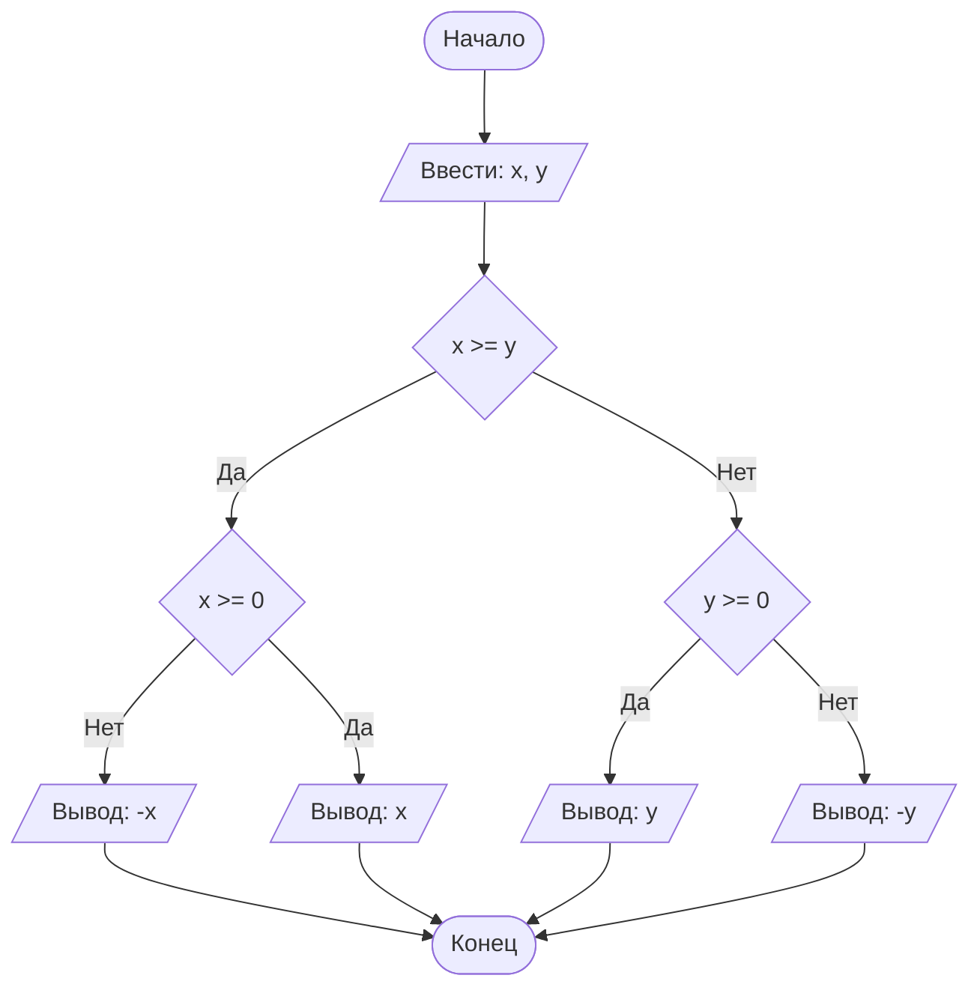

## Отчет по лабораторной работе № 1

#### № группы: `ПМ-2502`

#### Выполнил: `Соколов Евгений Станиславович`

#### Вариант: `20`

### Cодержание:

- [Постановка задачи](#1-постановка-задачи)
- [Входные и выходные данные](#2-входные-и-выходные-данные)
- [Выбор структуры данных](#3-выбор-структуры-данных)
- [Алгоритм](#4-алгоритм)
- [Программа](#5-программа)
- [Анализ правильности решения](#6-анализ-правильности-решения)

### 1. Постановка задачи

> Программа получает на вход 5 натуральных чисел X,A,B,C,D, где X - имеющиеся в магазине бананы в кг, а A,B,C,D - количество бананов, которое планируют купить первый, второй, третий и четвертый покупатели соответственно. Нужно найти количество покупателей, которые смогут купить запланированное количество бананов.

Данную задачу можно разделить на 2 подзадачи: нахождение максимального числа и получение модуля этого числа.

- Для 1 подзадачи нужно рассмотреть 2 случая:
    1. `X >= Y`
    2. `X < Y` (отрицание 1 случая)
- Пусть `Z = max(X, Y)`, тогда для 2 подзадачи нужно также рассмотреть 2 случая:
    1. `Z >= 0`
    2. `Z < 0` (отрицание 1 случая)

Всего надо рассмотреть `2 * 2 = 4` случая.

### 2. Входные и выходные данные

#### Данные на вход

На вход программа должна получать 5 чисел, при этом в условии не сказано, к какому множеству
принадлежать получаемые числа, поэтому будем считать их вещественными. 
|             | Тип                | 
|-------------|--------------------|
| X (Число 1) | Вещественное число | 
| A (Число 2) | Вещественное число |
| B (Число 3) | Вещественное число | 
| C (Число 4) | Вещественное число |
| D (Число 5) | Вещественное число |

#### Данные на выход

Т.к. программа должна вывести количество покупателей, которые смогут купить запланированное 
количество бананов, то на выход мы получим единственное целое число не превышающее количество покупателей, то есть 4.

|         | Тип                                | min значение | max значение   |
|---------|------------------------------------|--------------|----------------|
| Число 1 | Целое число                        | 0            | 4              |

### 3. Выбор структуры данных

Программа получает 5 вещественных чисел. Поэтому для их хранения
можно выделить 5 переменных (`X`, `A`, `B`, `C`, `D`) типа `double`.

|             | название переменной | Тип (в Java) | 
|-------------|---------------------|--------------|
| X (Число 1) | `X`                 | `double`     |
| A (Число 2) | `A`                 | `double`     | 
| B (Число 1) | `B`                 | `double`     |
| C (Число 2) | `C`                 | `double`     | 
| D (Число 1) | `D`                 | `double`     |

Для вывода результата необязательно его хранить в отдельной переменной.

### 4. Алгоритм

#### Алгоритм выполнения программы:

1. **Ввод данных:**  
   Программа считывает два вещественных числа, обозначенные как `x` и `y`.

2. **Сравнение чисел:**  
   Программа сравнивает значения `x` и `y`. Если `x` больше или равно `y`, программа переходит к следующему шагу для
   работы с `x`. Если `y` больше, программа выполняет действия для работы с `y`.

3. **Проверка знака для выбранного числа:**
    - Если было выбрано число `x` (так как оно больше или равно `y`), проверяется, положительное оно или отрицательное.
      Если `x` положительное, оно выводится на экран. Если отрицательное, выводится его модуль (т.е. противоположное
      по знаку значение).
    - Если было выбрано число `y` (поскольку оно больше `x`), выполняется аналогичная проверка. Если `y` положительное,
      оно выводится на экран. Если отрицательное, выводится его модуль.

4. **Вывод результата:**  
   На экран выводится либо большее из чисел, либо его модуль, если это число отрицательное.

#### Блок-схема

