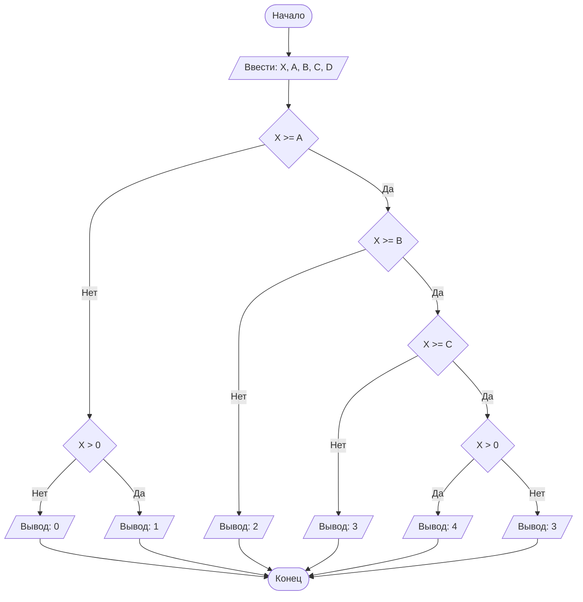

## Отчет по лабораторной работе № 1

#### № группы: `ПМ-2502`

#### Выполнил: `Соколов Евгений Станиславович`

#### Вариант: `20`

### Cодержание:

- [Постановка задачи](#1-постановка-задачи)
- [Входные и выходные данные](#2-входные-и-выходные-данные)
- [Выбор структуры данных](#3-выбор-структуры-данных)
- [Алгоритм](#4-алгоритм)
- [Программа](#5-программа)
- [Анализ правильности решения](#6-анализ-правильности-решения)

### 1. Постановка задачи

> Программа получает на вход 5 натуральных чисел X,A,B,C,D, где X - имеющиеся в магазине бананы в кг, а A,B,C,D - количество бананов, которое планируют купить первый, второй, третий и четвертый покупатели соответственно. Нужно найти количество покупателей, которые смогут купить запланированное количество бананов.

Данную задачу можно разделить на 4 подзадачи: узнать, хватит ли бананов первому покупателю, затем второму, третьему и четвертому.

- Для 1 подзадачи нужно рассмотреть 3 случая:
    1. `X >= A`
    2. `X < A` и `X = 0`
    3. `X < A` и `X > 0`
- Для второй и третьей подзадачи нужно рассмотреть 2 случая:
    1. `X >= B(C для третьей подзадачи)`
    2. `X < B(C для третьей подзадачи)` и `X = 0`
- Для 4 подзадачи нужно рассмотреть 2 случая:
    1. `X > 0`
    2. `X = 0`

Всего надо рассмотреть `7` случаев.

### 2. Входные и выходные данные

#### Данные на вход

На вход программа должна получать 5 чисел, при этом в условии не сказано, к какому множеству
принадлежать получаемые числа, поэтому будем считать их вещественными. 
|             | Тип                | 
|-------------|--------------------|
| X (Число 1) | Вещественное число | 
| A (Число 2) | Вещественное число |
| B (Число 3) | Вещественное число | 
| C (Число 4) | Вещественное число |
| D (Число 5) | Вещественное число |

#### Данные на выход

Т.к. программа должна вывести количество покупателей, которые смогут купить запланированное 
количество бананов, то на выход мы получим единственное целое число не превышающее количество покупателей, то есть 4.

|         | Тип                                | min значение | max значение   |
|---------|------------------------------------|--------------|----------------|
| Число 1 | Целое число                        | 0            | 4              |

### 3. Выбор структуры данных

Программа получает 5 вещественных чисел. Поэтому для их хранения
можно выделить 5 переменных (`X`, `A`, `B`, `C`, `D`) типа `double`.

|             | название переменной | Тип (в Java) | 
|-------------|---------------------|--------------|
| X (Число 1) | `X`                 | `double`     |
| A (Число 2) | `A`                 | `double`     | 
| B (Число 1) | `B`                 | `double`     |
| C (Число 2) | `C`                 | `double`     | 
| D (Число 1) | `D`                 | `double`     |


Для вывода результата нужно хранить его в отдельной переменной.
|                 | название переменной | Тип (в Java) | 
|-----------------|---------------------|--------------|
| count (Счётчик) | `count`             | `int`        |

### 4. Алгоритм

#### Алгоритм выполнения программы:

1. **Ввод данных:**  
   Программа считывает пять вещественных чисел, обозначенные как `X`, `A`, `B`, `C`, `D`.

2. **Сравнение чисел:**  
   Программа сравнивает значения `A` и `X`. Если `X` больше или равно `A`, программа вычитает `A` из `X`, увеличивает `count` на 1 и переходит к следующему шагу для
   работы с `B`. Если `A` больше, программа увеличивает `count` на 1. Затем программа проводит аналогичные действия для `B`, `C` и `D`

3. **Вывод результата:**  
   На экран выводится `count`.

#### Блок-схема



### 5. Программа

```java
import java.util.Scanner;

public class Main {
    public static void main(String[] args) {
        // Объявляем объект класса Scanner для ввода данных
        Scanner scanner = new Scanner(System.in);
        // Считывание данных из консоли
        double X = scanner.nextDouble(); // Количество килограмм бананов
        double A = scanner.nextDouble(); // Покупатель 1
        double B = scanner.nextDouble(); // Покупатель 2
        double C = scanner.nextDouble(); // Покупатель 3
        double D = scanner.nextDouble(); // Покупатель 4

        int count = 0; // Счетчик покупателей, которые смогли купить бананы

        if (X>=A){    // Смотрим, хватает ли бананов первому покупателю
            count++;
            X -= A;
            if (X>=B){ // Смотрим, хватает ли бананов второму покупателю
                count++;
                X -= B;
                if (X>=C){ // Смотрим, хватает ли бананов третьему покупателю
                    count++;
                    X -= C;
                    if (X>0){ // Смотрим, хватает ли бананов четвертому покупателю
                        count++;
                    }
                } else { // Если не хватает третьему
                    count++;
                }
            } else { // Если не хватает второму
                count++;
            }
        } else { // Если не хватает первому
            if (X>0) {
                count++;
            }
        }

        // Вывод результата
        System.out.println(count);
    }
}
```

### 6. Анализ правильности решения

Программа работает корректно на всем множестве решений.

1. Тест на `X = 0`:

    - **Input**:
        ```
        0 4 5 6 7
        ```

    - **Output**:
        ```
        0
        ```

2. Тест на `X<A X>0`:

    - **Input**:
        ```
        10 11 3 3 3
        ```

    - **Output**:
        ```
        1
        ```

3. Тест на `X>A X-A<B`:

    - **Input**:
        ```
        10 8 5 3 2
        ```

    - **Output**:
        ```
        2
        ```

4. Тест на `X>A X-A>B X-A-B>C`:

    - **Input**:
        ```
        10 5 4 6 8
        ```

    - **Output**:
        ```
        3
        ```

5. Тест на `X>A X-A>B X-A-B>C X-A-B-C>0 `:

    - **Input**:
        ```
        10 2 3 4 5
        ```

    - **Output**:
        ```
        4
        ```
